<h2>TensorFlow-FlexUNet-Image-Segmentation-FedBCa-Bladder-Cancer-T2W (2026/09/22)</h2>
Sarah T. Arai  
Software Laboratory antillia.com  
This is the first experiment in Image Segmentation for <b>Bladder-Cancer-MRI</b>
 based on
our <a href="https://github.com/sarah-antillia/TensorFlow-FlexUNet-Image-Segmentation-Model">TensorFlowFlexUNet Model</a>
 (<b>TensorFlow Flexible UNet Image Segmentation Model for Multiclass</b>) and a 512x512-pixel PNG
 <a href="https://drive.google.com/file/d/1W8k58bjQWF3gD1XVy9Z4FuexHxGSgNVX/view?usp=sharing">
FedBCa-ImageMask-Dataset.zip</a> (<a href="https://creativecommons.org/licenses/by/4.0/legalcode.en">CC BY 4.0</a>) , 
which was derived by us from the Zenodo 
  
<a href="https://zenodo.org/records/13622759">
<b>A multi-center MRI dataset for bladder cancer and baseline evaluations of federated learning 
in its clinical application
</b>
</a>
  

<b>Actual Image Segmentation for FedBCa Bladder Cancer Images of 512x512 pixels</b> 
As shown below, the inferred masks resemble the ground-truth masks except for the seccond case.  
 
<table>
<tr>
<th width="320" height="auto">Input: image</th>
<th width="320" height="auto">Mask (ground_truth)</th>
<th width="320" height="auto">Prediction: inferred_mask</th>
</tr>
<tr>
<td>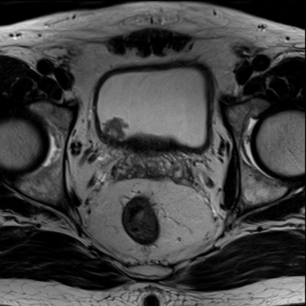</td>
<td></td>
<td></td>
</tr>
<tr>
<td>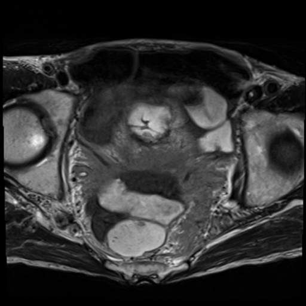</td>
<td></td>
<td></td>
</tr>
<tr>
<td>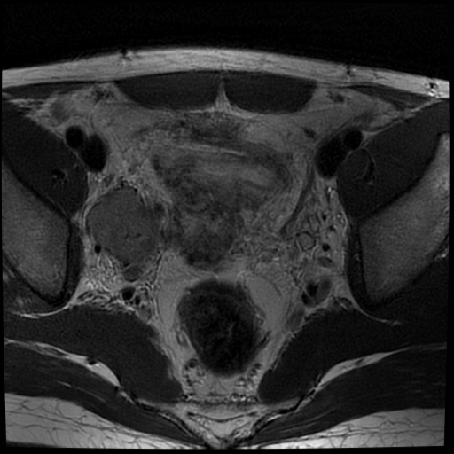</td>
<td></td>
<td></td>
</tr>
</table>

 
<h3>1. Dataset Citation</h3>
The dataset used here was derived from the Zenodo:  
<a href="https://zenodo.org/records/13622759">
<b>A multi-center MRI dataset for bladder cancer and baseline evaluations of federated learning 
in its clinical application
</b>
</a>
  
Cao, Kangyang; Zou, Yujian; Zhang, Chang; Zhang, Weijing; Zhang, Jie; Wang, Guojie;  Zhang, Chu;  
Lyu, Jiegeng; Sun, Yue; Zhang, Hongyuan et al. 
  
The following explanation (excerpt) was taken the website above.
  
<b>Abstract</b> 
Bladder cancer (BCa), as the most common malignant tumor of the urinary system, 
has received significant attention in research on the clinical application of artificial intelligence algorithms.
  
Nevertheless, it has been observed that certain investigations employ data from diverse medical facilities to 
train models for BCa, thereby posing a potential risk of leaking patients' privacy. 
Ensuring the privacy of patients during the training of machine learning algorithms is a vital consideration 
that deserves significant attention.   
<b>Federated learning (FL)</b> is an emerging machine learning paradigm that enables multiple entities to 
collaboratively build machine learning models while preserving data privacy and security. 
  
In this study, we present a multi-center BCa magnetic resonance imaging (MRI) dataset,  aimed at evaluating 
the baseline performance of FL.  
The dataset comprises 275 three-dimensional bladder T2-weighted MRI scans collected from four medical centers, 
and each scan includes diagnostic pathological labels for muscle invasion and fine pixel-level annotations 
of tumor contours. Four FL methods are used to assess the baseline of the dataset 
for both the task of diagnosing muscle-invasive bladder cancer and automatic bladder tumor lesion segmentation.
  
<b>Citation</b> 
Cao, K., Zou, Y., Zhang, C., Zhang, W., Zhang, J., Wang, G., Zhang, C., Lyu, J., Sun, Y., Zhang, 
 H., Huang, B., Deng, L., Li, J., & Huang, B.  
 (2024). A multi-center MRI dataset for bladder cancer and baseline evaluations of federated learning  
 in its clinical application [Dataset]. 
 Zenodo. <a href="https://doi.org/10.5281/zenodo.13622759">
https://doi.org/10.5281/zenodo.13622759
 </a>
  
<b>License</b> 
<a href="https://creativecommons.org/licenses/by/4.0/legalcode.en">
Creative Commons Attribution 4.0 International</a>
 
 
<h3>2. FedBCa ImageMask Dataset</h3>
<h3>2.1 Download ImageMask Dataset</h3>
 If you would like to train this Bladder-Cancer Segmentation model,
 please download the dataset from Google Drive  
 <a href="https://drive.google.com/file/d/1W8k58bjQWF3gD1XVy9Z4FuexHxGSgNVX/view?usp=sharing">
FedBCa-ImageMask-Dataset.zip</a> (<a href="https://creativecommons.org/licenses/by/4.0/legalcode.en">CC BY 4.0</a>) . 
Expand the downloaded ImageMaskDataset and put it under the <b>./dataset</b> folder.
 
<pre>
./dataset
└─FedBCa
    ├─test
    │   ├─images
    │   └─masks
    ├─train
    │   ├─images
    │   └─masks
    └─valid
         ├─images
         └─masks
</pre>
 
<b>FedBCa Statistics</b> 
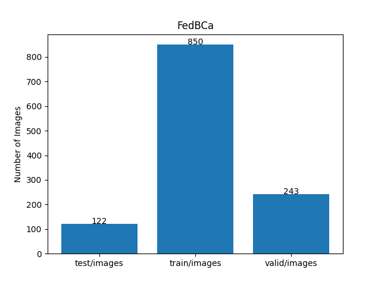 
 
As shown above, the number of images in the training and valid datasets is not large enough to use for the
 training set of our segmentation model.
 
<h3>2.2 Derivation of ImageMask Dataset</h3>
The folder structure of the original dataset is as follows.
<pre>
./FedBCa
├─Center1
│  ├─Annotation
│  └─T2WI
├─Center2
│  ├─Annotation
│  └─T2WI
├─Center3
│  ├─Annotation
│  └─T2WI
└─Center4
    ├─Annotation
    └─T2WI
</pre>
We generated a 512x512-pixel PNG ImageMask dataset  
from the NIfTI image files in <b>T2WI</b> subfolder and the 
corresponding NIfTI mask files in <b>Annotation</b> subfolder in each <b>Center</b> data folder 
by using the Python script <a href="./generator/ImageMaskDatasetGenerator.py">ImageMaskDatasetGenerator.py</a> 
 
<h3>2.3 Train Sample Images and Masks</h3>
<b>Train_sample_images</b> 
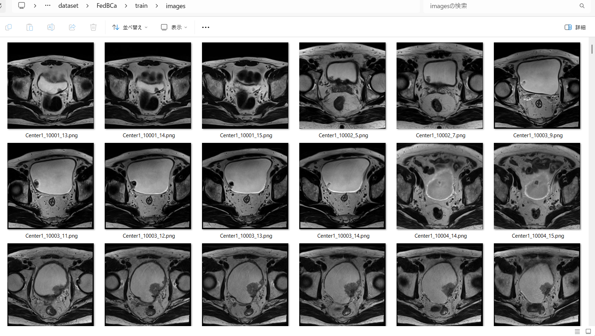
 
<b>Train_sample_masks</b> 
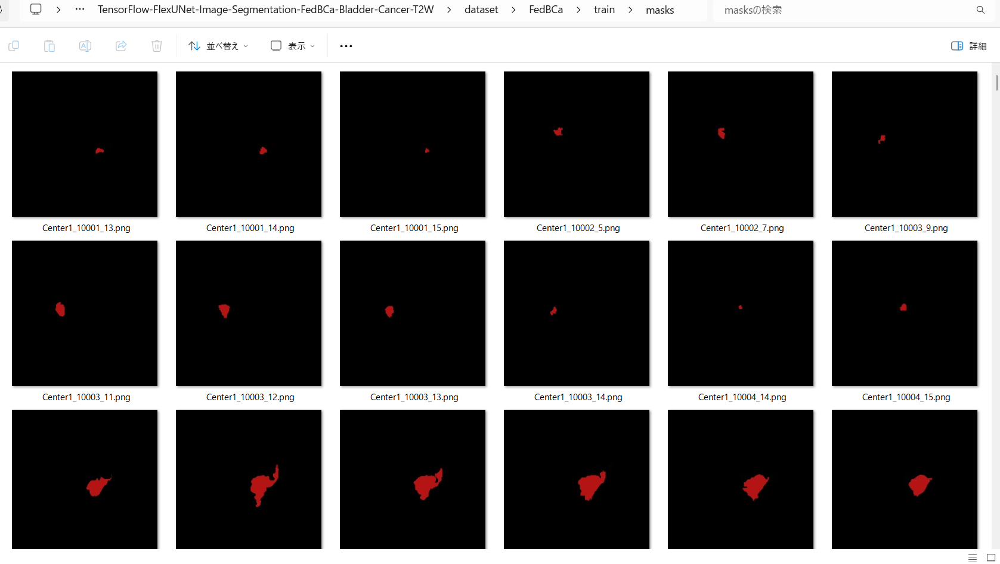
 
<h3>3. Train TensorFlowFlexUNet Model</h3>
 We trained the Bladder-Cancer TensorFlowFlexUNet model using the following
<a href="./projects/TensorFlowFlexUNet/FedBCa/train_eval_infer.config"> <b>train_eval_infer.config</b></a> file.  
Please move to ./projects/TensorFlowFlexUNet/FedBCa and run the following bat file. 
<pre>
>1.train.bat
</pre>
This runs the following command. 
<pre>
>python ../../../src/TensorFlowFlexUNetTrainer.py ./train_eval_infer.config
</pre>

<b>Model parameters</b> 
Defined a small <b>base_filters=16 </b> and large <b>base_kernels=(11,11)</b> for the first Conv Layer of Encoder Block of 
<a href="./src/TensorFlowFlexUNet.py">TensorFlowFlexUNet.py</a> 
and a large <b>num_layers=8</b> (including a bridge between Encoder and Decoder Blocks).
<pre>
[model]
; You may specify your own UNet class derived from our TensorFlowFlexModel
model         = "TensorFlowFlexUNet"
generator     =  False
image_width    = 512
image_height   = 512
image_channels = 3
num_classes    = 3
base_filters   = 16
base_kernels   = (11,11)
num_layers     = 8
dropout_rate   = 0.04
; Defined a large dilation
dilation       = (3,3)
</pre>
<b>Learning rate</b> 
Defined a small learning rate.  
<pre>
[model]
learning_rate  = 0.00007
</pre>
<b>Loss and metrics functions</b> 
Specified "categorical_crossentropy" and <a href="./src/dice_coef_multiclass.py">"dice_coef_multiclass"</a>. 
<pre>
[model]
loss           = "categorical_crossentropy"
metrics        = ["dice_coef_multiclass"]
</pre>
<b>Dataset class</b> 
Specifed <a href="./src/ImageCategorizedMaskDataset.py">ImageCategorizedMaskDataset</a> class. 
<pre>
[dataset]
class_name    = "ImageCategorizedMaskDataset"
</pre>
 
<b>Learning rate reducer callback</b> 
Enabled the learning_rate_reducer callback and a small reducer_patience.
<pre> 
[train]
learning_rate_reducer = True
reducer_factor     = 0.4
reducer_patience   = 4
</pre>
<b>Early stopping callback</b> 
Enabled early stopping callback with the patience parameter.
<pre>
[train]
patience      = 10
</pre>

<b>RGB Color map</b> 
Specified RGB color map dict for Bladder-Cancer 2 classes. 
<pre>
[mask]
mask_datatype= "categorized"
mask_file_format = ".png"
; Bladder-Cancer RGB color map dict for 1+1 classes.
;      Background: black, Cancer: dark_red
rgb_map = {(0,0,0):0,(180,20,20):1,}

</pre>

<b>Epoch change inference callback</b> 
Enabled <a href="./src/EpochChangeInferencer.py">epoch_change_infer callback</a></b>. 
<pre>
[train]
epoch_change_infer       = True
epoch_change_infer_dir   =  "./epoch_change_infer"
num_infer_images         = 6
</pre>

By using this callback, on every epoch change, the inference procedure can be called
 for 6 images in the <b>mini_test</b> folder. This will help you confirm how the predicted mask changes 
 at each epoch during your training process.  
  
As shown below, early in the model training, the predicted masks from our UNet segmentation model showed 
discouraging results.
 However, as training progressed through the epochs, the predictions gradually improved. 
   
 
<b>Epoch_change_inference output at starting (epoch 1,2,3)</b> 
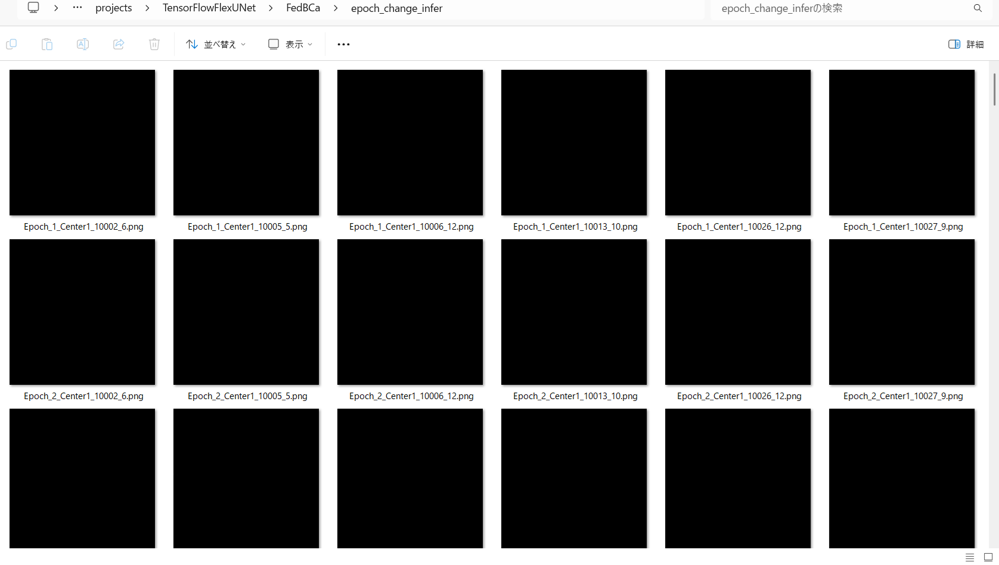 
 
<b>Epoch_change_inference output at middlepoint (epoch 19,20,21)</b> 
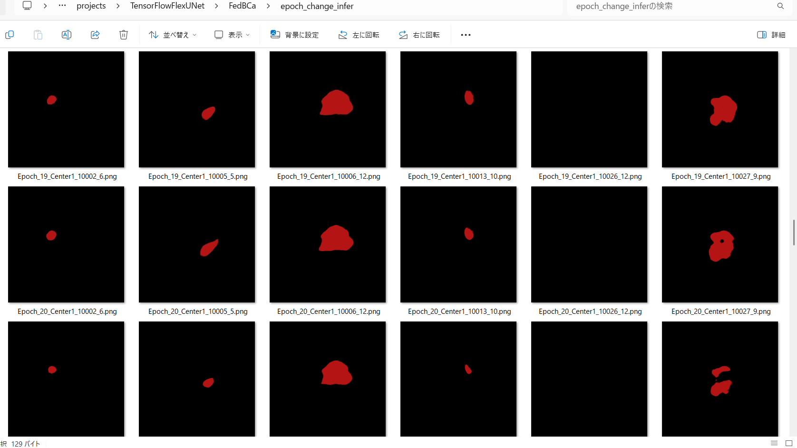 
 
<b>Epoch_change_inference output at ending (epoch 39,40,41)</b> 
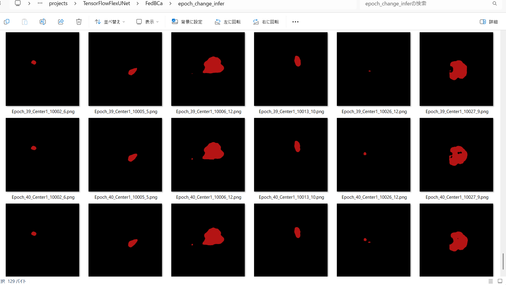 
 
In this experiment, the training process was stopped at epoch 41 by EarlyStoppingCallback. 
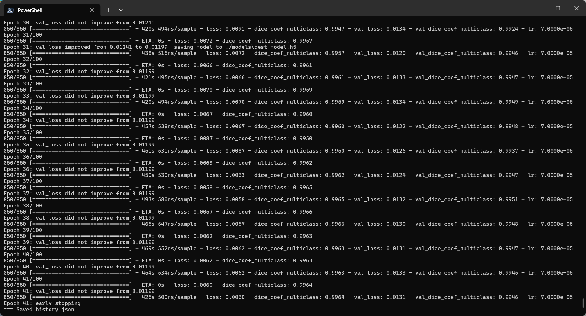 
 
<a href="./projects/TensorFlowFlexUNet/FedBCa/eval/train_metrics.csv">train_metrics.csv</a> 
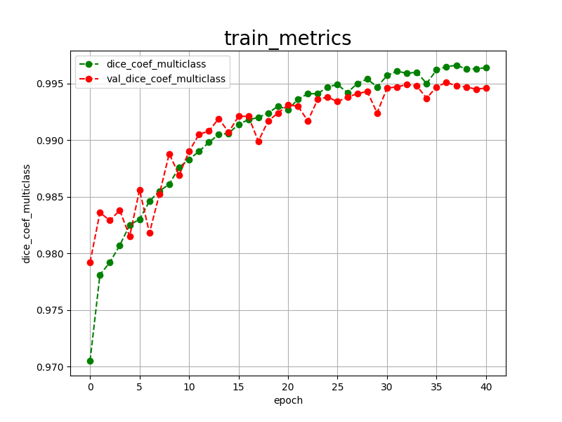 
 
<a href="./projects/TensorFlowFlexUNet/FedBCa/eval/train_losses.csv">train_losses.csv</a> 
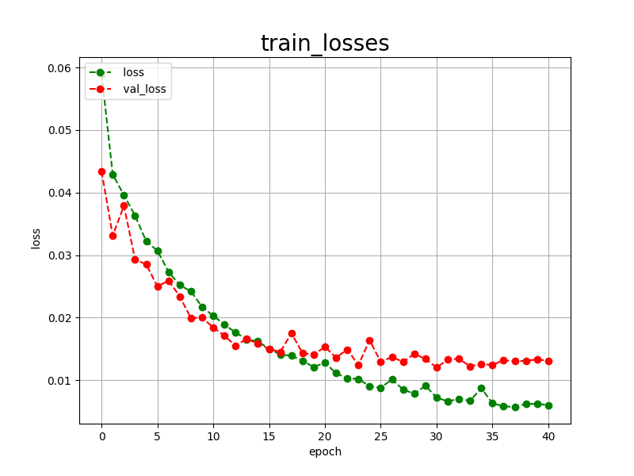 
 
<h3>4. Evaluation</h3>
Please move to <b>./projects/TensorFlowFlexUNet/FedBCa</b> folder, 
and run the following bat file to evaluate the TensorFlowUNet model for Bladder-Cancer. 
<pre>
./2.evaluate.bat
</pre>
This runs the following command.
<pre>
python ../../../src/TensorFlowFlexUNetEvaluator.py ./train_eval_infer_aug.config
</pre>

Evaluation console output: 
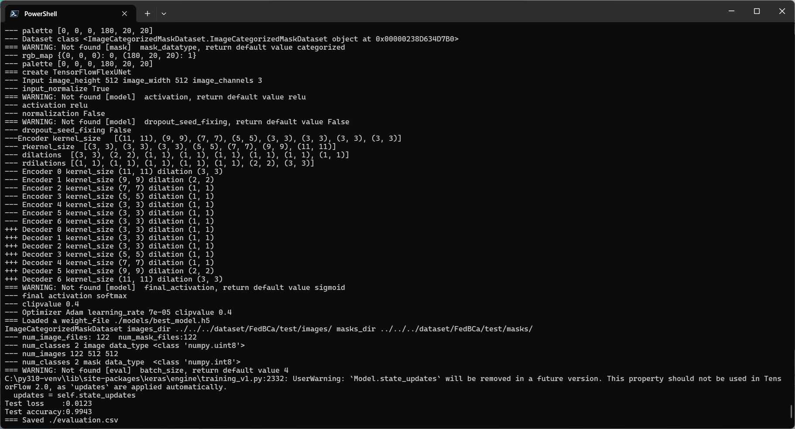
  Image-Segmentation-Bladder-Cancer

<a href="./projects/TensorFlowFlexUNet/FedBCa/evaluation.csv">evaluation.csv</a> 
The loss (categorical_crossentropy) on this Bladder-Cancer/test was low, and dice_coef_multiclass was high, as shown below.
 
<pre>
categorical_crossentropy,0.0123
dice_coef_multiclass,0.9943
</pre>
 

<h3>5. Inference</h3>
Please move to <b>./projects/TensorFlowFlexUNet/FedBCa</b> folder
and run the following bat file to infer segmentation regions for images using the trained TensorFlowUNet model for Bladder-Cancer. 
<pre>
./3.infer.bat
</pre>
This runs the following command.
<pre>
python ../../../src/TensorFlowFlexUNetInferencer.py ./train_eval_infer_aug.config
</pre>

<b>mini_test_images</b> 
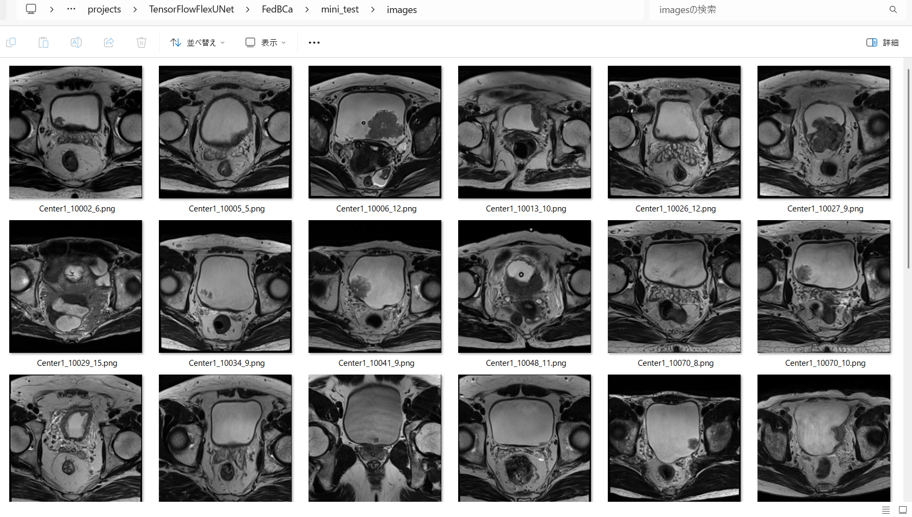 
<b>mini_test_mask(ground_truth)</b> 
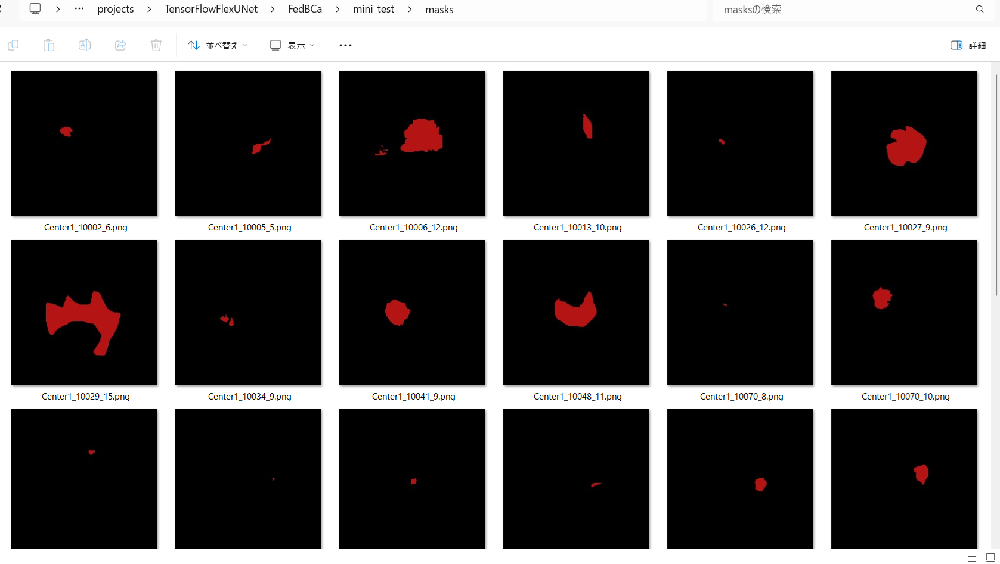 

<b>Inferred test masks</b> 
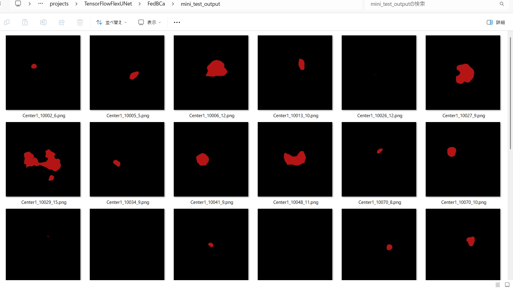 
 

<b>Enlarged images and masks for FedBCa Bladder Cancer Images of 512x512 pixels</b> 
As shown below, the inferred masks look similar to the ground truth masks except for the second and fourth cases. 
 
<table>
<tr>
<th width="320" height="auto">Image</th>
<th width="320" height="auto">Mask (ground_truth)</th>
<th width="320" height="auto">Inferred-mask</th>
</tr>
<tr>
<td>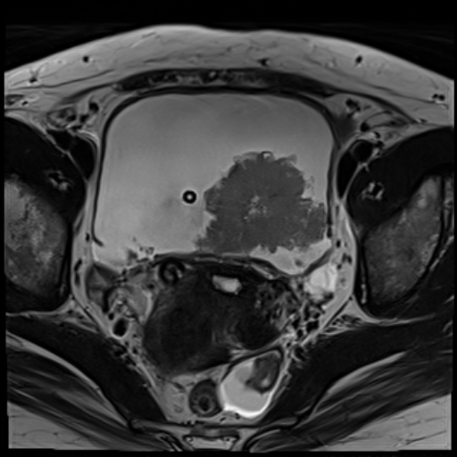</td>
<td></td>
<td></td>
</tr>
<tr>
<td>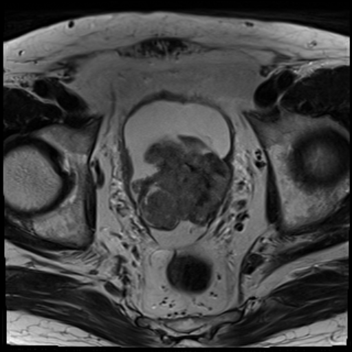</td>
<td></td>
<td></td>
</tr>
<tr>
<td>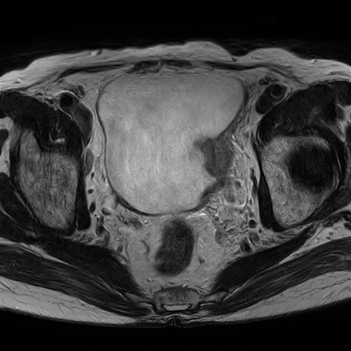</td>
<td></td>
<td></td>
</tr>
<tr>
<td>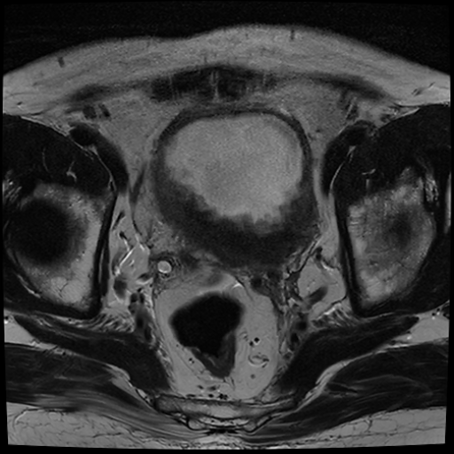</td>
<td></td>
<td></td>
</tr>
<tr>
<td>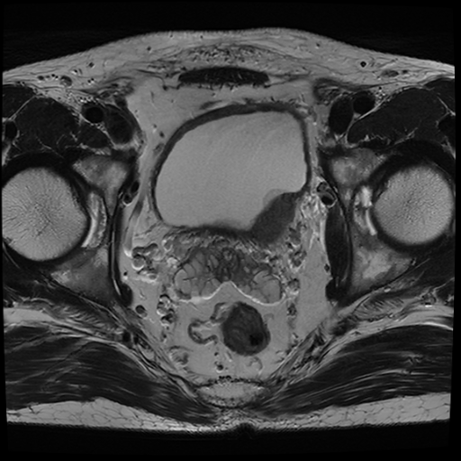</td>
<td></td>
<td></td>
</tr>
<tr>
<td>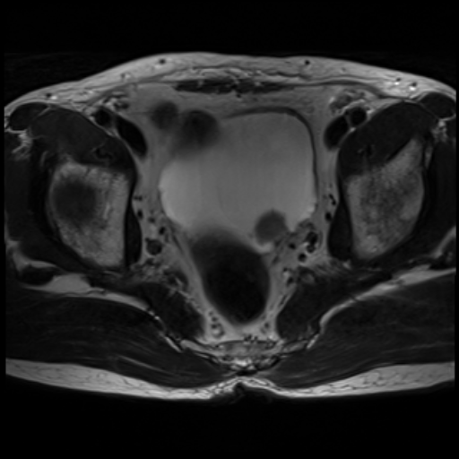</td>
<td></td>
<td></td>
</tr>
</table>

 
 
<h3>
6. 3D Volume Segmentation
</h3>
Please move to <b>./projects/TensorFlowFlexUNet/FedBCa</b> folder
and run the following bat file to infer image segmentation for 2D slices of 3D volume NIfTI files
 using the trained TensorFlowFlexUNet model for FedBCa. 
<pre>
>./5.infer3d.bat
</pre>
This simply runs the following command.
<pre>
>python ../../../src/TensorFlowFlexUNet3DInferencer.py ./train_eval_infer.config
</pre>
<b>infer3d section </b> in <a href="./projects/TensorFlowFlexUNet/FedBCa/train_eval_infer.config">
train_eval_infer.config
<a></b>
<pre>
[infer3d] 
; Specify an images_dir which contains NIfTI or NPY files
images_dir    = "./mini_test_3d/images/"
output_dir    = "./mini_test_3d_output/"
slice_shape_order = "hwd"
slice_normalize = True
slice_resize   = (512,512)
; Specify a cv2.rotation mode as a string.
slice_rotation = "cv2.ROTATE_90_CLOCKWISE" 

mask_overlay  = True
</pre>

<b>Acutual Image Segmentation for 2D Slices of a FedBCa NIfTI</b> 
Some Slices, Inferred Masks and Mask overlays for a 3D volume <b>017.nii.gz</b> file 
in 
<b>FedBCa/Center1/T2WI</b> folder. 
 
<table>
<tr>
<th>Image</th>
<th>Inferred-mask</th>
<th>Mask overlay</th>
</tr>

<tr>
<td>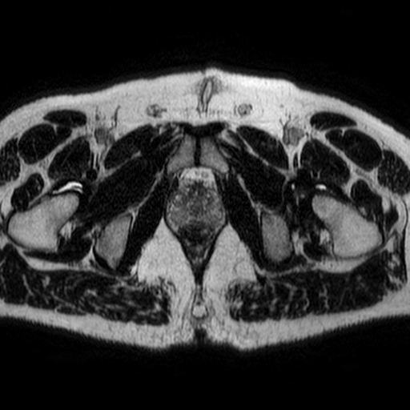</td>
<td></td>
<td>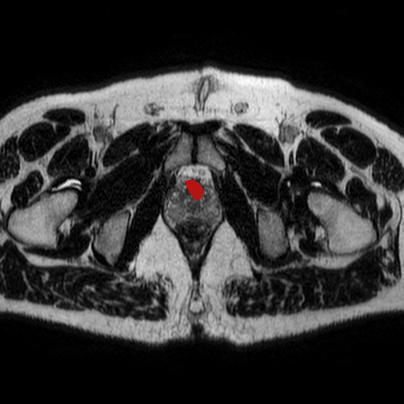</td>
</tr>

<tr>
<td>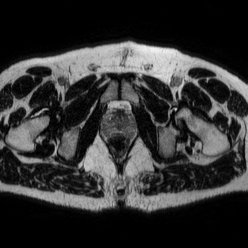</td>
<td></td>
<td>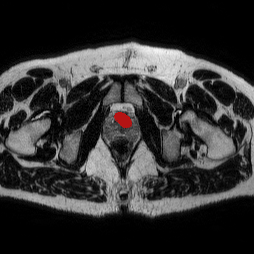</td>
</tr>
<tr>
<td>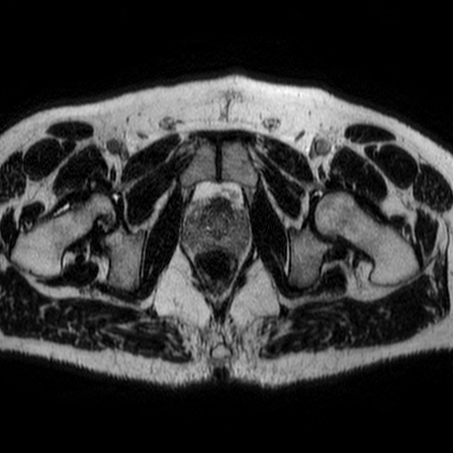</td>
<td></td>
<td>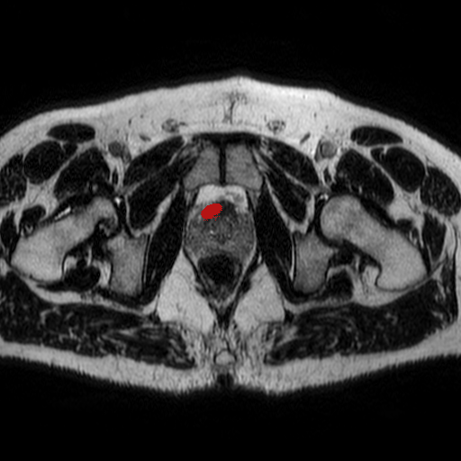</td>
</tr>
<tr>
<td>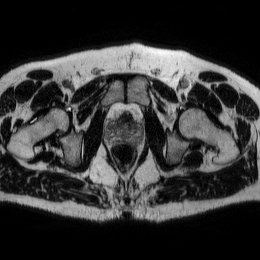</td>
<td></td>
<td>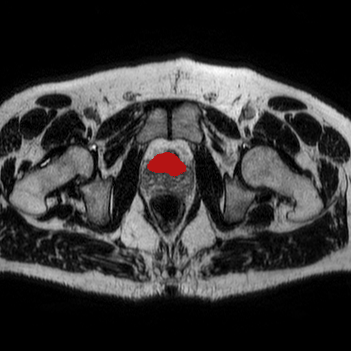</td>
</tr>
<tr>
<td>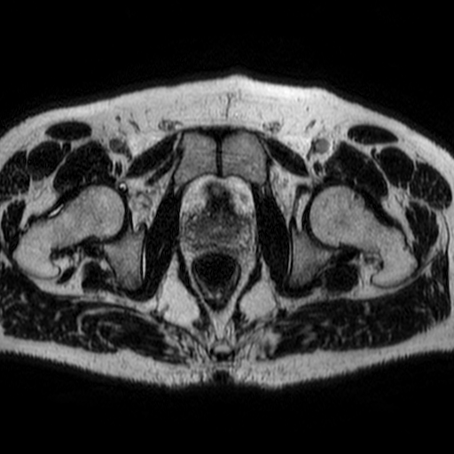</td>
<td></td>
<td>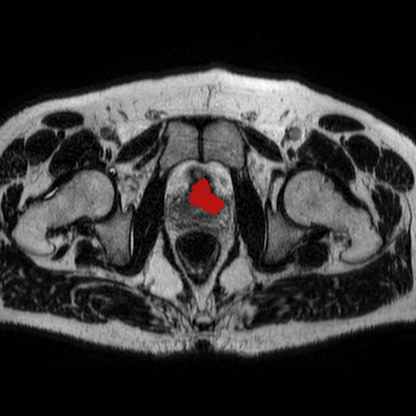</td>
</tr>
<tr>
<td>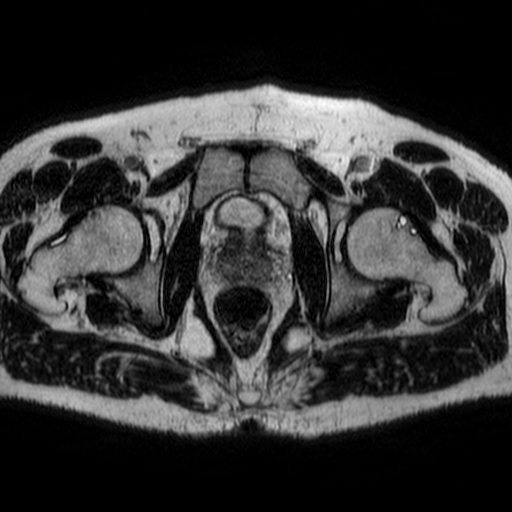</td>
<td></td>
<td>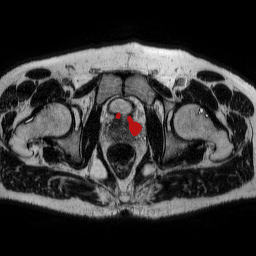</td>
</tr>
</table>

 
<h3>
7. MaskOverlay Video of 3D Volume Segmentation
</h3>
Please move to <b>./projects/TensorFlowFlexUNet/FedBCa</b> folder, and run the following bat file 
to generate <b>overlays.mp4</b> or <b>overlay.gif</b> for MaskOverlays of 3D Volume Segmentation.  
<pre>
>./6.video3d.bat
</pre>
This simply runs the following command.
<pre>
>python ../../../src/MaskOverlayVideoGenerator.py ./train_eval_infer.config
</pre>
 
<b>infer3d section </b> in <a href="./projects/TensorFlowFlexUNet/FedBCa/train_eval_infer.config">
train_eval_infer.config
<a></b>
<pre>
[infer3d] 
mask_overlay  = True
; Specify ".mp4" or ".gif".
;video_fileformat  = ".mp4"
video_fileformat  = ".gif"
</pre>
 
<b>overlays.gif</b> 
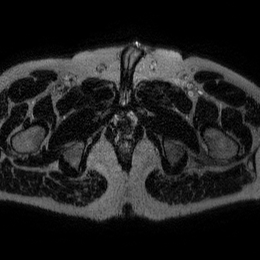
 
 
<h3>
References
</h3>
<b>1. A Semi-Supervised Multi-Region Segmentation Framework of Bladder Wall and 
 Tumor with Wall-Enhanced Self-Supervised Pre-Training</b> 
Jie Wei, Yao Zheng, Dong Huang, Yang Liu, Xiaopan Xu, Hongbing Lu 
<a href="https://pmc.ncbi.nlm.nih.gov/articles/PMC11672963/">
https://pmc.ncbi.nlm.nih.gov/articles/PMC11672963/
</a>
  
<b>2. Multi-region segmentation of bladder cancer structures in MRI with progressive  
dilated convolutional network</b> 
Jose Dolz, Xiaopan Xu, Jerome Rony, Jing Yuan, Yang Liu, Eric Granger, Christian Desrosiers, 
Ismail Ben Ayed, and Hongbing Lu 
<a href="https://arxiv.org/pdf/1805.10720">
https://arxiv.org/pdf/1805.10720
</a>
  
<b>3. Deep Learning Algorithms for Bladder Cancer Segmentation on Multi-Parametric MRI</b> 
Kazim Z. Gumus, Julien Nicolas, Dheeraj R. Gopireddy, Jose Dolz, Seyed Behzad Jazayeri and Mark Bandyk 
<a href="https://www.mdpi.com/2072-6694/16/13/2348">
https://www.mdpi.com/2072-6694/16/13/2348</a>
 
 
<b>4. TensorFlow-FlexUNet-Image-Segmentation-Bladder-Cancer-MRI</b> 
Toshiyuki Arai 
<a href="https://github.com/sarah-antillia/TensorFlow-FlexUNet-Image-Segmentation-Bladder-Cancer-MRI">
https://github.com/sarah-antillia/TensorFlow-FlexUNet-Image-Segmentation-Bladder-Cancer-MRI
</a>
  
<b>5. TensorFlow-FlexUNet-Image-Segmentation-Model</b> 
Toshiyuki Arai 
<a href="https://github.com/sarah-antillia/TensorFlow-FlexUNet-Image-Segmentation-Model">
https://github.com/sarah-antillia/TensorFlow-FlexUNet-Image-Segmentation-Model
</a>
  
